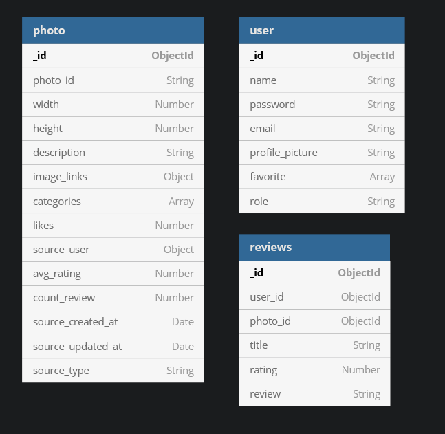
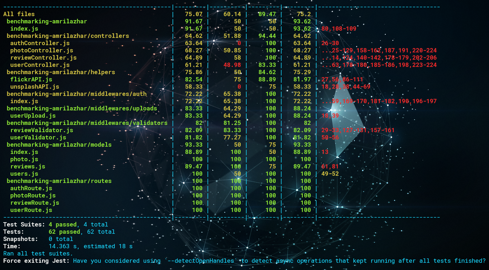

# AZH Browse & Photo Review
This is a simple backend API for browsing and giving review (locally) about photos, from flickr and unplash.

## Feature
1. Basic Authentication (using JWT)
2. Browse and Searc Photo from Flickr and Unsplash
3. Giving Review to Photo
4. Update Our Profile
5. Add Photo to Our Favorite Collection

## Instalation
To Install the API there is some requirement that we need to meet,
1. Mongo DB database (local / atlas)
2. NodeJS Server
3. Flickr API Key (it can be access here [Flicker](https://www.flickr.com/services/api/), but need register first)
4. Unsplash API Key (it can be access here [Unsplash](https://unsplash.com/developers), but need register first)

To install the App just clone it, and run `npm install` inside the project folder, then we need to create file `.env.development` with format like this :

```
UNSPLASH_ACCESS_KEY = <key> 
UNSPLASH_SECRET_KEY = <key> 
JWT_SECRET = <jwt secret> 
PUBLIC_URL = https://localhost (you can change it)
MONGO_URI = <uri> 
FLICKR_API_KEY = <key> 
FLICKR_SECRET_KEY = <key>
```

To run the code just type `npm run dev`

# DB Diagram
Here the database design, which consist of 3 tables :


# Unit Test
For ensure code stability when there are change in the code, we conduct a unit test,
this is the result :



* __note : full report of the test can be seen in  `./coverage/Icov-report/index.html`__
# Full Documentation
Full documentation and how to use can be seen here : https://documenter.getpostman.com/view/15024355/TzeTJUbG
